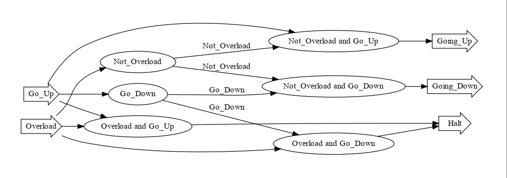

# UNION - lab 3 - variant 4

- Develop a eDSL for Moore finite state machine.
- Develop unit tests.
- Develop input data control in the aspect-oriented style.

## Project structure

- `mfsm.py` -- implementation of `DiscreteEvent` class and `Node`class.
- `mfsm_test.py` -- unit tests for `mfsm`.

## Contribution

- Liao Pengfei (212320014@hdu.edu.cn)
- Wang Luyao(wlysbox@126.com)

## Changelog

- 17.06.2022
  - Add `mfsm.py`.
  - Add `mfsm_test.py`.
- 20.06.2022
  - Add decorators.

## Design notes

Visualisation of mfsm:

